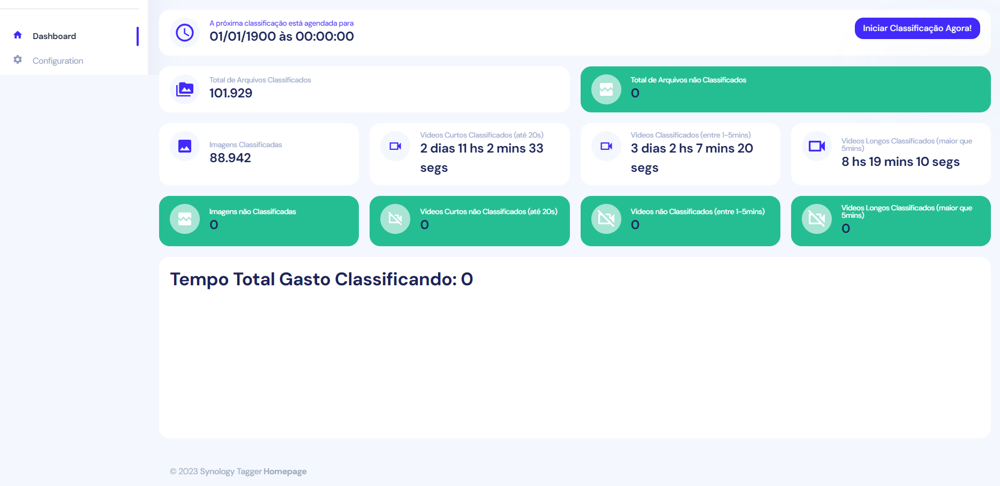

# Synology Tagger

This project have no affiliation with the company Synology. I have a NAS from them and decided to make it a little better. Also, use it at your own risk. No support is provided, as stated in the license.

This tool offers a straightforward way to enhance the search functionality in Synology Photos. It leverages machine learning to categorize images and store the classifications as tags within the pictures. Since Synology Photos can already search for tags, this means that if, for instance, the ML model identifies a picture as featuring a dog, a plant vase, and an orange, you can easily retrieve the image by searching for these terms. 

To achieve this, the tool saves the list of tags in the `general_tag` table and establishes an N-to-N relationship through the `many_unit_has_many_general_tag` table.

## !!! IMPORTANT !!!
`
You can't run this code directly in the Synology-NAS. DSM don't have the required libraries to compile pycocotools. Also, it would take forever...
`

## Installation

# Requirements
1. Docker Compose
2. 20gb of free space (I know, ML stuff eats resources like nothing else)

# Steps

1. Rename [.env.default](.env.default) to .env
2. Fill the .env variables as best as you can

| Config                           | Description                                                                                            | Required   |
| ---------------------------------| ------------------------------------------------------------------------------------------------------ | --------- |
| SYNOLOGY_HOST                    | IP address of the Synology NAS.                                                                        | *   |
| PG_USERNAME                      | Internal DSM Postgres username. You don't need to change this. The system can create a user as long as SSH access is configured. | *   |
| PG_PASSWORD                      | Internal DSM Postgres password. Set any password you want. The system can create a password as long as SSH access is configured. | *   |
| SSH_PORT                      | SSH port to access Synology NAS. SSH access needs to be enabled in the NAS |    |
| SSH_USERNAME                      | SSH username to access Synology NAS. SSH access needs to be enabled in the NAS |    |
| SSH_PASSWORD                      | SSH password to access Synology NAS. SSH access needs to be enabled in the NAS |    |
| MEDIA_FOLDER                      | Don't change this. Its the local (container) folder where the media will be located | *   |
| THRESHOLD                      | The classificator will only tag if the detection exceds the threshold. For instance, if the algoritm detects a plant with 30% of certainty, it would be discarded as the default threshold is 40% | *   |
| VIDEO_THRESHOLD                      | Same as before, but for videos | *   |
| DEVICE                      | What device will be used to classify the media. GPU's are considerably faster, but right now its only compatible with NVIDIA GPUs supporting CUDA 11.3 | *   |
| MYSQL_USER                      | Internal MySQL database user. Don't change this. | *   |
| MYSQL_PASSWORD                      | Internal MySQL database password. Don't change this. | *   |
| CRONTAB                      | Used for scheduling. You can use the web interface to change this. | *   |

3. Mount (Linux) or map (windows) the "homes" shared folder in your computer
4. Add the mounted/mapped folder to line 17 on [docker-compose](https://github.com/eleonne/synology-tagger/blob/2.0/docker-compose.yml) 
Template: `<path in your machine>`:/media/synology-nas:ro  
Example: `/media/my-nas-mapped-folder`:/media/synology-nas:ro
5. Navigate to the project folder and `docker-compose up`
6. Access http://localhost:8081

## TO DO next
Translation

